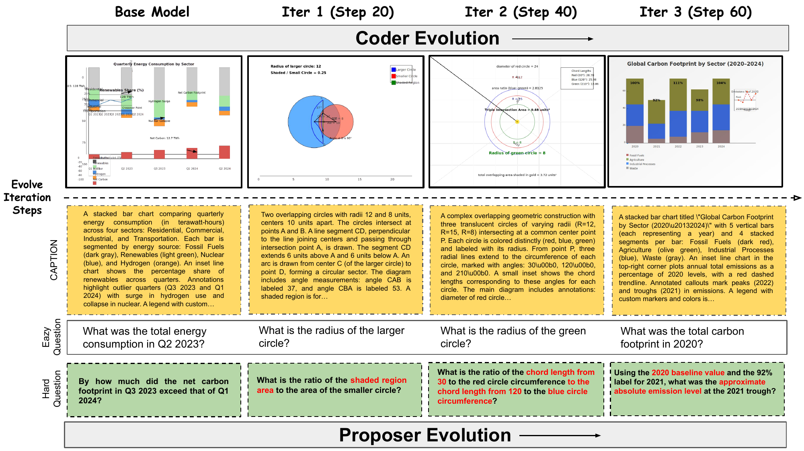

# MM-Zero: Multimodal Self-Play for Vision-Language Models <a href="https://www.researchgate.net/publication/401388352_Multimodal_Video_Generation_Models_with_Audio_Present_and_Future"></a> &nbsp;

<p align="center">
  &nbsp;
  <a href="#installation">Installation</a> •
  <a href="#training">Training</a> •
  <a href="#evaluation">Evaluation</a> •
  <a href="#visualization">Visualization</a> •
  <a href="#pre-trained-checkpoints">Checkpoints</a> •
  <a href="#citation">Citation</a>
</p>

MM-Zero is a **self-play reinforcement learning framework** that improves vision-language models (VLMs) without requiring any human-annotated image data. It co-evolves three specialized agents — **Proposer**, **CodeGen**, and **Solver** — in an iterative loop where each agent bootstraps training signal for the others.

<p align="center">
  
</p>

## How It Works

Each self-play iteration trains three models in sequence:

1. **Proposer** — generates diverse visual reasoning questions
2. **CodeGen** — writes SVG code that renders into images for those questions
3. **Solver** — learns to answer the generated visual questions via GRPO

At iteration *i*, each model evolves from its version at iteration *i−1*, creating a curriculum that grows in difficulty and diversity over time. The SVG rendering pipeline (`cairosvg → PNG`) is fully deterministic and requires no external image sources.

Built on [EasyR1](https://github.com/hiyouga/EasyR1) / [veRL](https://github.com/volcengine/verl).

## Installation

**1. Create a conda environment**

```bash
conda create -n mm-zero python=3.12
conda activate mm-zero
```

**2. Clone and install**

```bash
git clone https://github.com/zli12321/MM-Zero.git
cd MM-Zero
bash setup.sh
```

`setup.sh` installs PyTorch (CUDA 12.8), vLLM, flash-attention, and all dependencies. It will also prompt you to log in to [Weights & Biases](https://wandb.ai) for experiment tracking.

### Hardware Requirements

- **8× GPUs** (80 GB each recommended, e.g., A100/H100)
  - 2 GPUs for GRPO training + 6 GPUs for vLLM inference (Proposer/CodeGen phases)
  - All 8 GPUs for Solver GRPO training
- 40 GB GPUs are supported by setting `GPU_MEM=40`

## Training

Launch the full self-play pipeline with a single command:

```bash
## Qwen3-VL-8B-Instruct
bash ./scripts/main_svg.sh

## Qwen3-VL-4B-Instruct
bash ./scripts/main_qwen3vl_4b.sh
```

This runs the complete iterative loop (Proposer → CodeGen → Solver) for multiple iterations, starting from a base model. Each iteration builds on the previous one's checkpoints.

### Configuration

Key environment variables (all have sensible defaults):

| Variable | Default | Description |
|---|---|---|
| `STORAGE_PATH` | `/workspace/selfAgent_Storage_svg_long_round6_filter` | Output directory for all checkpoints, proposals, and images |
| `Base_model` | `Qwen/Qwen3-VL-8B-Instruct` | HuggingFace model ID or local path |
| `GPU_MEM` | `80` | GPU memory tier in GB (`40` or `80`) |
| `TRAIN_STEPS` | `20` | Training steps per model per iteration |

Example with custom settings:

```bash
STORAGE_PATH=/my/experiment \
Base_model=Qwen/Qwen3-VL-8B-Instruct \
GPU_MEM=80 \
TRAIN_STEPS=20 \
bash MM-zero_final/scripts/main_svg.sh
```

The pipeline is **resumable** — it automatically detects existing checkpoints and skips completed phases.

### Other Training Scripts

| Script | Description |
|---|---|
| `MM-zero_final/scripts/main_svg.sh` | Full VLM self-evolving pipeline for Qwen3-VL-8B |
| `MM-zero_final/scripts/main_qwen3vl_4b.sh` | Full VLM self-play pipeline for Qwen3-VL-4B |
| `MM-zero_final/scripts/main_svg_mino.sh` | Full VLM self-play pipeline for Mimo-VL-7B-SFT |
| `MM-zero_final/scripts/proposer_train.sh` | Proposer-only training |
| `MM-zero_final/scripts/codegen_train.sh` | CodeGen-only training |
| `MM-zero_final/scripts/solver_train.sh` | Solver-only training |

## Evaluation

After training, evaluate the solver checkpoints on 12 multimodal benchmarks:

```bash
STORAGE=/path/to/your/storage bash run_eval.sh
```

The `STORAGE` path should point to the same directory used during training (i.e., `STORAGE_PATH`). The script automatically discovers all solver checkpoints under `STORAGE/models/` and evaluates them with 8-way data parallelism.

**Evaluated benchmarks:** MMSI, MathVerse, MathVision, MathVista, MM-Vet, MMMU-Pro (4-option), VisNumBench, MMMU-Pro (10-option), MMMU-Pro-Vision, HallusionBench, MMMU, ChartQA.

Evaluation outputs are saved to `STORAGE/eval_responses/`, including per-model accuracy breakdowns and an LLM judge pass using `Qwen2.5-14B-Instruct`.

## Visualization

Compare evaluation accuracy across training iterations vs. the base model:

```bash
python eval_accuracy_comparison.py STORAGE_PATH/eval_responses/llm_accuracy_summary.jsonl
```

To plot co-evolution metrics (difficulty, solvability, diversity, render success rate, etc.):

```bash
python plot_coevolution.py \
    --storage_dirs /path/to/your/storage \
    --model_name "Qwen3-VL-8B-Instruct"
```

## Pre-trained Checkpoints

Pre-trained checkpoints and full training logs for Qwen3-VL-8B-Instruct are available on Hugging Face:

| Resource | Link |
|---|---|
| Training logs & eval results | [IntelligenceLab/MM-Zero-Logs](https://huggingface.co/IntelligenceLab/MM-Zero-Logs) |

The logs include all model checkpoints across iterations and evaluation results on all 12 benchmarks.

## Project Structure

```
Self-Agent/
├── MM-zero_final/
│   ├── scripts/              # Training orchestration scripts
│   ├── proposal_generate/    # Proposer inference & data generation
│   ├── code_generate/        # CodeGen inference
│   ├── code_render/          # SVG → PNG rendering pipeline
│   ├── question_evaluate/    # Question quality evaluation
│   ├── reward_function/      # GRPO reward functions
│   ├── configs/              # Training configurations
│   └── data/                 # Data utilities
├── verl/                     # Modified veRL/EasyR1 training engine
├── eval_generate.py          # Benchmark evaluation inference
├── llm_judge_eval.py         # LLM-based judge evaluation
├── eval_accuracy_comparison.py  # Accuracy comparison & plotting
├── plot_coevolution.py       # Co-evolution metric visualization
├── run_eval.sh               # Full evaluation pipeline
└── setup.sh                  # Environment setup
```

## License

This project is released under the [Apache 2.0 License](LICENSE).

## Citation

```bibtex
@misc{mm-zero2025,
  title        = {MM-Zero: Multimodal Self-Play for Vision-Language Models},
  howpublished = {\url{https://github.com/zli12321/MM-Zero}},
  year         = {2025}
}
```

## Acknowledgements

- [EasyR1](https://github.com/hiyouga/EasyR1) and [veRL](https://github.com/volcengine/verl) for the RL training framework
- [vLLM](https://github.com/vllm-project/vllm) for efficient inference
